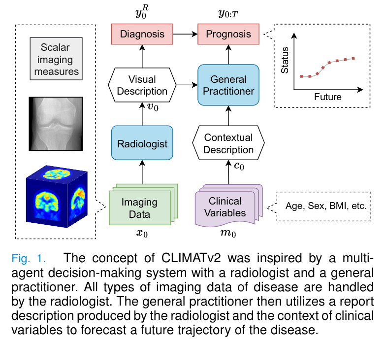
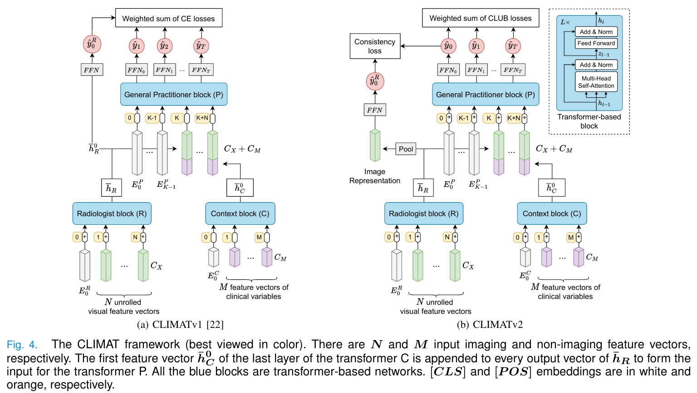
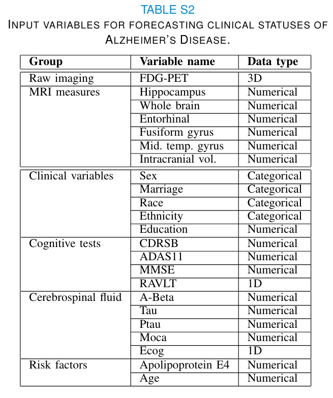
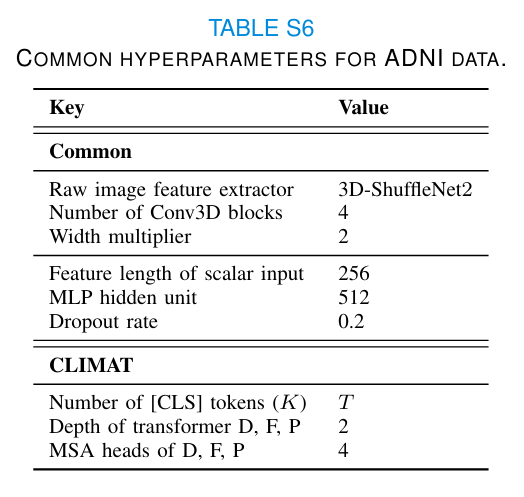
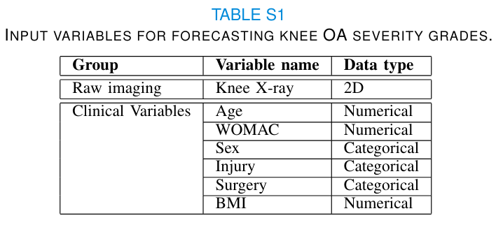
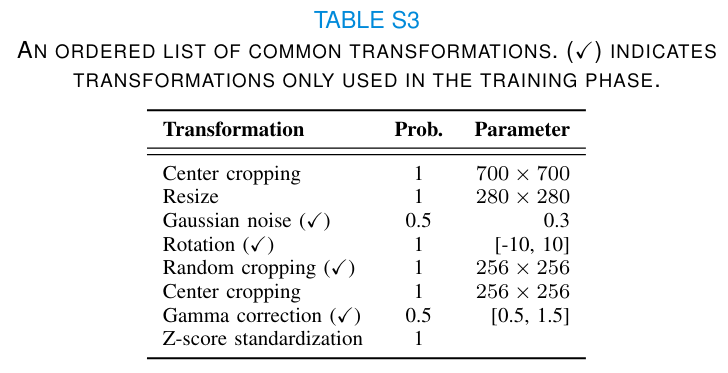

# CLIMATv2: Clinically-Inspired Multi-Agent Transformers for Disease Trajectory Forecasting from Multimodal Data

This is the implementation of the paper CLIMATv2: https://arxiv.org/abs/2210.13889. Its previous version (CLIMATv1) can be found at https://arxiv.org/abs/2104.03642.

The concept of the framework is as follows




The differences of CLIMATv2 compared to CLIMATv1 are:
- General practitioner (GP) is allowed to utilize multimodalities to perform diagnosis prediction (i.e, y_0)
- The diagnosis predictions of Radiologist and GP is enforced to be consistent
- Cross-entropy loss is replaced by CLUB (Calibrated Loss based on Upper Bound), which takes into account both **performance** and **calibration** during optimization.  
 


---


## Setup
Run commands:
```bash
git clone git@github.com:Oulu-IMEDS/CLIMATv2.git
cd ./CLIMATv2
conda create -n CLIMATv2 python=3.7
conda activate CLIMATv2
pip install -e .
```

---

## [ADNI] Alzheimer's Disease Status Prognosis Prediction

### Input



### Data preparation

You can use the ADNI metadata prepared in `./adni/Metadata/adni_fdgpet_prognosis.csv`, or regenerated them using
```bash
# Modify input and output paths, then run
python ./common/adni/preprocess_adni.py
# Standard voxels if needed
python ./common/adni/standardize_voxels.py
```

### Training

Command line:
```bash
# General setting using default values in configuration files in ./adni/configs/config_train.yaml
python train.py config=seq_multi_prog_climatv2

# Detailed setting
python train.py config=seq_multi_prog_climatv2 comment=mycomment \
    bs=${BATCH_SIZE} num_workers=${NUM_WORKERS} root.path=/path/to/ANDI meta_root=/path/to/meta_dir/ fold_index=1 \
    backbone_name=shufflenetv2 max_depth=4 num_cls_num=4 prognosis_coef=1 cons_coef=0.5 \ 
    loss_name=CLUB club.s=0.5
```

`config` can be
- `seq_multi_prog_climatv1`: CLIMATv1
- `seq_multi_prog_climatv2`: CLIMATv2

Processing:
- `bs`: batch size
- `num_workers`: the number of workers

Data setup:
- `root.path`: root directory of images
- `meta_root`: root directory of metadata (.csv or saved split configuration in .pkl)
- `fold_index`: fold index (starting from 1)

Model:
- `backbone_name`: backbone for imaging feature extraction
- `max_depth`: the number of CNN blocks in imaging feature extraction module
- `n_meta_features`: the length of metadata features
- `num_cls_num`: the number of [CLS] embebddings in transformer P

Coefficients in loss 
- `prognosis_coef`: coefficient for prognosis prediction
- `cons_coef`: coefficient for consistency term

`loss_name` is either 
- `CLUB`: Calibrated loss based on upper bound (ours). `club.s`:  epsilon hyperparameter in CLUB.
- `CE`: cross-entropy loss
- `FL`: focal loss
- `FLA`: adaptive focal loss
- `MTL`: multi-task loss

Hyperparameters used in the paper:



### Evaluation

```bash
python eval.py root.path=/path/to/imgs_dir/ meta_root=/path/to/metadata_dir/ \
    eval.root=/path/to/trained_models_dir/ eval.patterns=${PATTERN} eval.output=/path/to/output.json \
    use_only_baseline=True seed=${SEED} \
    save_predictions=${SAVE_PREDICTIONS} save_attn=${SAVE_ATTENTION_MAPS}
```

Input data for evaluation:
- `root.path`: root directory of images
- `meta_root`: root directory of metadata (.csv or saved split configuration in .pkl)
- `eval.root`: root directory containing sub-directories of trained settings 
- `eval.patterns`: a common pattern of saved model files (e.g., `pn_avg_ba` for average balanced accuracies, or `pn_avg_mauc` for average mAUCs)
- `eval.output`: path to file storing evaluation results
- `use_only_baseline`: whether to use data at the baseline as input (always `True`)
- `save_predictions`: whether to save predictions for visualization
- `save_attn`: whether to save attention maps for visualization

---

## [OAI] Knee Osteoarthritis Structural Prognosis Prediction

### Input



### Data preparation

Run commands:
```bash
# Generate longitudinal data
python ./common/prepare_1img_seq_metadata.py

# Split data
python ./common/do_split.py
```

### Training

```bash
# General setting using default values in configuration files in ./oai/configs/config_train.yaml
python train.py config=seq_multi_prog_climatv2

# Detailed setting
python train.py config=seq_multi_prog_climatv2 \
    bs=64 num_workers=8 root.path=/path/to/OAI/ meta_root=/path/to/meta_dir backbone_name=resnet18 site=C \ 
    prognosis_coef=1.0 cons_coef=0.5 loss_name=CLUB n_meta_features=128 \ 
    num_cls_num=8 club.s=0.5 grading=KL \
    fold_index=1 seed=12345 
```

Besides the arguments used for ADNI, we have the additional arguments for OAI: 

Data:
- `site`: test acquisition site (`C`, with the most data, is chosen for testing, meaning that sites `A`, `B`, `D`, `E` are used for training and validation.)

`grading` can be:
- `KL`: Kellgren and Lawrence
- `JSL`: Lateral joint space
- `JSM`: Medial joint space
- `OSFL`: Lateral osteophyte in femur
- `OSFM`: Medial osteophyte in femur
- `OSTL`: Lateral osteophyte in tibia
- `OSTM`: Medial osteophyte in tibia

List of augmentations applied to knee images 
(**Note**: all right knee images are vertically flipped):



### Evaluation

Same as above.

---

## Reference
If you find the manuscript or codes useful, please cite as follows
```
@article{nguyen2022clinically,
  title={Clinically-Inspired Multi-Agent Transformers for Disease Trajectory Forecasting from Multimodal Data},
  author={Nguyen, Huy Hoang and Blaschko, Matthew B and Saarakkala, Simo and Tiulpin, Aleksei},
  journal={arXiv preprint arXiv:2210.13889},
  year={2022}
}
